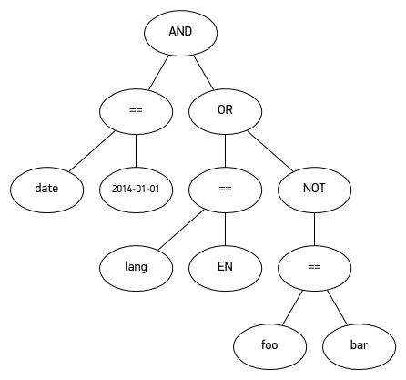

# expr-go
将bool表达式的字符串，运行得到结果。

## 说明
通过构建二叉树的方式，获得一个bool表达式的二叉树，（详见：[Fun with binary expression trees and Go](https://alexkappa.com/fun-with-tree-structures-and-go-interfaces)），通过接口的定义的Eval方法递归计算出bool表达式的值。  
  


## 示例
```go
	opts := []*Opt{
		{Operator: CONTAINS, Value: "john"},
		{Operator: OR},
		{Operator: CONTAINS, Value: "smith"},
		{Operator: OR},
		{Operator: CONTAINS, Value: "marry"},
	}
	var current *Opt
	for _, opt := range opts {
		current = AddOpt(current, opt)
	}
	line := Line("hello world ")
	exp := current.Get()
	util.Infof("%v", exp.Eval(line))
```

